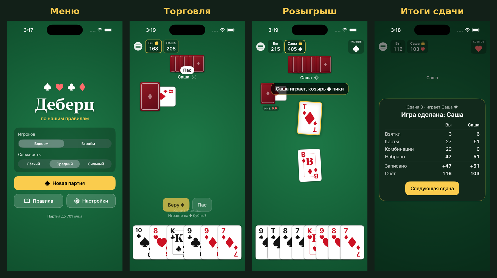

# Деберц

[](https://github.com/islam2412/deberc/actions/workflows/ci.yml)

Карточная игра Деберц для iPhone и iPad — по нашим домашним правилам, против компьютера.

**Установить:** публичная ссылка TestFlight появится здесь после одобрения первой сборки ([как выложить](docs/TESTFLIGHT.md)).



## Что умеет

- 2 или 3 игрока: вы и один-два компьютерных соперника. Партия до 701 очка.
- Все наши правила: торговля в два круга, «обязы», обмен козырной семёрки, четыре семёрки, терцы, полтинники, бэла, байт и висячий байт, штрафы за байты и за «голого». Каждое правило можно переключить в настройках.
- Оформление в духе Карачаево-Черкесии: на картинках — карачаевцы, русские и черкесы в национальной одежде, соперники — зверята в костюмах, на рубашке — золотой орнамент с бараньими рогами и Эльбрусом ([об иллюстрациях](docs/ART.md)).
- Восемь соперников со своими именами и характером: кто-то играет осторожно, кто-то рискует. Четыре уровня: **Новичок**, **Любитель**, **Знаток**, **Мастер**.
- Подсказка, отмена хода, запись партии по сдачам, после сдачи можно посмотреть карты всех игроков.
- Крупные карты, четырёхцветная колода, звук и вибрация — по желанию.
- Статистика: победы и серии, отдельно против каждого соперника и уровня.
- Партия сохраняется: можно выйти и продолжить позже.
- Без интернета, рекламы и регистрации. Ничего не собирает ([политика конфиденциальности](PRIVACY.md)).

Вопрос или ошибка — пишите на islamytchaev@gmail.com, что приложить — в [SUPPORT.md](SUPPORT.md).

Работает на iOS и iPadOS 16.4 и новее: iPhone 8 и новее, iPad 5-го поколения и новее.

Полный свод правил — в [RULES.md](RULES.md).

## Устройство проекта

| Папка | Что внутри |
|---|---|
| `DebercKit/` | Swift-пакет: движок игры, подсчёт, ИИ и персонажи, тексты. Не зависит от iOS, покрыт тестами. |
| `Deberc/` | Приложение на SwiftUI (iPhone и iPad). |
| `Deberc.xcodeproj` | Проект Xcode (нужен Xcode 26 или новее). |
| `Config/Deberc.xcconfig` | Team ID, Bundle ID, версия и номер сборки. |
| `Config/Info.plist` | Экран запуска и одно окно на iPad; остальные ключи Info.plist Xcode собирает из настроек проекта. |
| `.github/workflows/` | CI, загрузка в TestFlight, турнир ботов, скриншоты для App Store. |
| `scripts/` | Проверка на симуляторе, App Store Connect API (`asc.py`), иконка, иллюстрации (`prepare_art.py`), скриншоты для App Store (`appstore-shots.sh`, `frame-shots.py`), картинка для README. |
| `docs/` | Инструкция по TestFlight, тексты и подписи к скриншотам для App Store Connect, откуда иллюстрации ([ART.md](docs/ART.md)). |

## Запуск на своём iPhone/iPad

1. Откройте `Deberc.xcodeproj` в Xcode 26+.
2. Выберите схему **Deberc** и своё устройство.
3. Во вкладке **Signing & Capabilities** выберите свою команду (Team) — или впишите Team ID в `Config/Deberc.xcconfig`.
4. Нажмите **Run** (⌘R).

## Проверки

**Движок и ИИ** — работают и на Linux (Swift 5.9+):

```sh
cd DebercKit
swift test
```

**CI** на каждый push: тесты движка (предупреждения компилятора считаются ошибками), архив Release как для TestFlight, проверка на трёх симуляторах — iPhone SE с крупным шрифтом, iPhone 6,9″ и iPad (сборка Release). На симуляторах приложение открывает все экраны, играет само с собой вдвоём и втроём на разных уровнях, доходит до итогов сдачи и до конца партии. Проверка падает, если приложение закрылось, игра встала или появился отчёт о сбое. Скриншоты и логи — в артефактах запуска. Правки только документации CI не запускают.

Вручную (Actions → CI → Run workflow) можно ещё проверить старую iOS (поле `old_ios`, например `16.4`) и будущий Xcode (поле `xcode`).

**Турнир ботов** (Actions → Турнир ботов) — уровни играют друг против друга на Linux, итоги в сводке запуска. Запускается и сам при правках ИИ.

**Симулятор на своём Mac:**

```sh
xcodebuild -project Deberc.xcodeproj -scheme Deberc -destination 'generic/platform=iOS Simulator' \
  -derivedDataPath build/DerivedData CODE_SIGNING_ALLOWED=NO build
scripts/simulator-smoke-test.sh run build/DerivedData/Build/Products/Debug-iphonesimulator/Deberc.app iphone-small build/smoke
```

Параметры проверки (устройства, сценарии, размер шрифта) описаны в начале `scripts/simulator-smoke-test.sh`.

**Скрипты:** `python3 -m unittest discover -s scripts/tests` (для `asc.py` и `frame-shots.py` нужен `pip install -r scripts/requirements.txt`).

## Иконка, картинка для README и скриншоты

- Иконка — валет пик и рубашка с орнаментом на сукне, карты нарисованы по той же геометрии, что в игре. Три варианта (обычная, тёмная, тонированная): `python3 scripts/icon/render_kchr_icon.py install jack-back` (нужны Pillow и исходники в `art-raw/`, см. [ART.md](docs/ART.md)).
- `docs/preview.png` собирает `scripts/make-preview.py` из скриншотов. Workflow «Скриншоты для App Store» делает это сам: картинка лежит в артефакте `preview`.
- Скриншоты для App Store с подписями: `scripts/appstore-shots.sh` снимает кадры на симуляторе, `scripts/frame-shots.py` кладёт их на сукно под подписи из `docs/appstore/ru/captions.txt` (подробно — в [APP_STORE_CONNECT.md](docs/APP_STORE_CONNECT.md)).

## TestFlight

Пошаговая инструкция, как выложить приложение в публичный TestFlight: [docs/TESTFLIGHT.md](docs/TESTFLIGHT.md).
Тексты и настройки для App Store Connect: [docs/APP_STORE_CONNECT.md](docs/APP_STORE_CONNECT.md).
Политика конфиденциальности: [PRIVACY.md](PRIVACY.md). Поддержка: [SUPPORT.md](SUPPORT.md).
